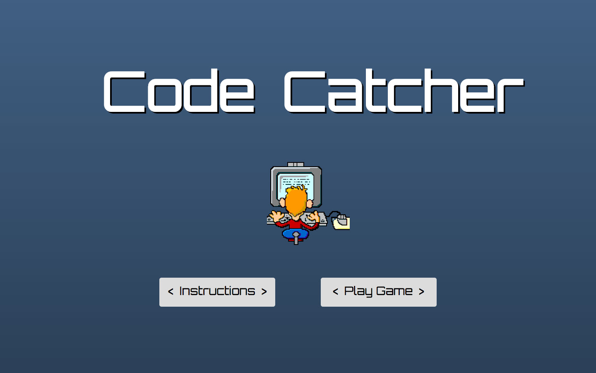
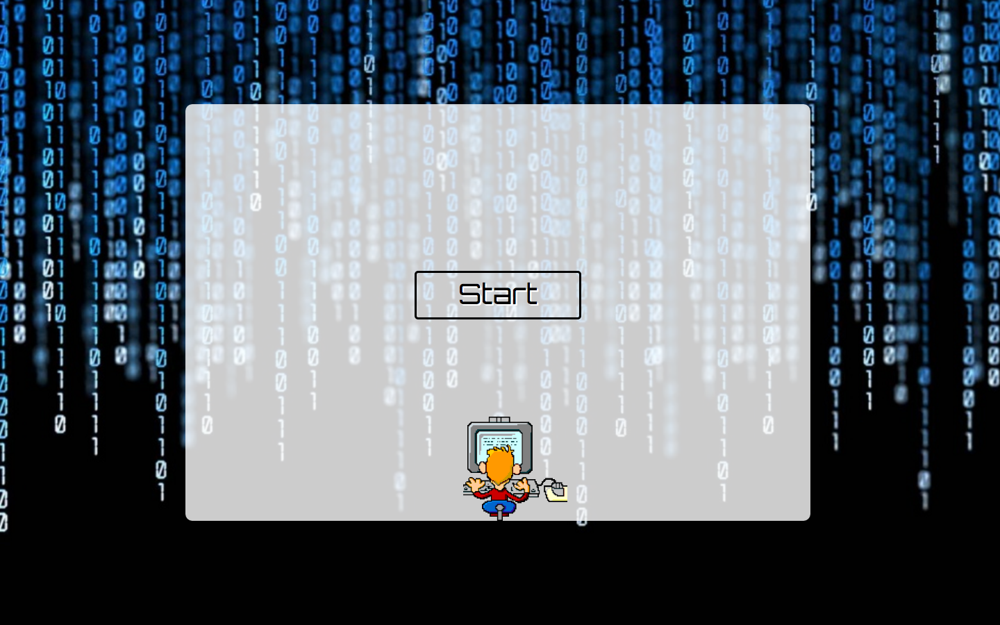
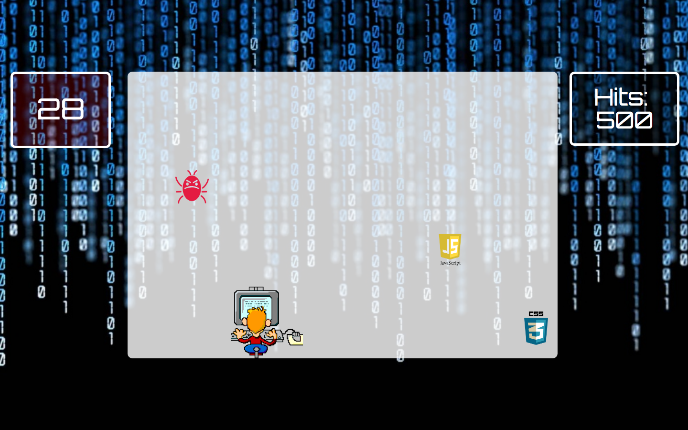

##GA WDI 25 London - Project 1

#Code Catcher

######A game of skill with an 'in joke' for Web Devs

In the first project of the Web Development Immersive course, we were tasked with designing and developing an interactive game over seven days. I wanted to create a game which implemented the learning from the previous 2 weeks of the course, and which also challenged me to learn and develop my coding abilities further.

####The result is... Code Catcher ([click to play](https://code-catcher.herokuapp.com/))

&nbsp;

***

###The rules are simple:

* Use the left/right arrow keys to move the coder.
* Catch falling pieces of code to build your score.
* Get the highest score possible in 1 minute.
* Do not catch any falling 'code bugs', they will decrease your score.

&nbsp;

&nbsp;

***

&nbsp;

###How it works

The transparent white game play area (codewall) has 10 equally positioned divs (columns) positioned across the top. Before the game starts, these column divs are hidden.

When the player clicks start, an event listener on the start button shows the timer and starts it counting down from 60 secs. It also displays the score board, and chooses one of the column divs at random.

A function is run to dynamically assign the chosen column div with an image and corresponding class, choosing from an array which contains 'html', 'css', 'javascript' and 'bug'. Once the div has an image, it fades in and is animated down to the bottom of the codewall, before it is reset to the top and hidden again.

In the image above you can see that column 2 has been randomly assigned an image and class of 'bug', 'javascript' for column 8 and 'css' for column 10.

The coder is able to move left and right along the bottom of the codewall, controlled by an event listener on the left and right arrow keys. An if statement within the animate function tracks the progress of the falling column div. If the falling div is within the same range as the coder at the bottom of the screen, a 'catchResult' variable is updated with the class of the div and the score is updated accordingly.

Additionally, if a bug image is caught, a shake animation is run on the coder and a negative 'buzz' sound is triggered. If a code image is caught, a positive 'pop' sound is triggered.

The falling images are linked to the timer, so a new div falls every second. However the duration of the fall is decreased slightly each time, so the gameplay becomes faster and more hectic as the timer runs out.

####The build

* HTML 5, CSS and jQuery were used to create the game.
* The Google Web Font 'Orbitron' has been used to style the text.

###Problems & Challenges

The first challenge was working out how to detect when the coder caught a code or bug (a div collision). I had to use the progress function of .animate to track both the coder and the falling div to manually work out a range of their positions. Using a range instead of set positions mean that a catch is more achievable, but using a range also created a problem. As both the div and coder passed through that range, a catch was recorded up to 18 times, drastically affecting the score. My solution was to create a variable to store the catch result, and update the score based on that variable, before resetting the variable to null.

Another problem was setting boundaries for the coder's movements. The coder is able to move left and right along the full width of the codewall in one keypress. This is fine when starting at the edge, but moving from mid-screen allows the coder to move outside the codewall borders. By tracking the progress of the coder and re-positioning it to the edge of the codewall if it ends up outside, I now have a suitable workaround which creates a 'snap-back' effect.

The biggest challenge was in the function which randomly assigns an image to a div. It was sometimes re-assigning a div's image while it was mid-fall. This meant that a bug could change it's image to code mid-animation but when caught it would deduct points as a bug normally would. I created an if else statement to detect if the image was currently being animated before it assigned an image to the div. However this didn't stop images being reassigned on the fade-in before the animation starts. I had to remove the if else statement and create a while loop which would choose a different div if the chosen one was already being animated. That seems to have resolved the issue.

###Future Improvements

Going forward, I would like to make the following improvements to the game...

######Functionality
* CSS responsiveness - allow the game to work on other screen sizes.
* Increase the speed of the coder's movements as the divs fall faster, allowing for more skilled gameplay at faster speeds.
* Time bonuses for score 'checkpoints'.
* Decrease the 1 second gap between each code/bug falling as the game speeds up - will need to separate it from the timer.
* Set defined boundaries for the coder's movements.

######Styling
* When the game ends, move the final score to just above the 'Play Again' button.
* Include a High Score box to provide a competitive edge for multiple players.
* Make the timer background flash red for the last 5 seconds of the game.
* Change the sound effects, using a different sound for each type of code caught.
